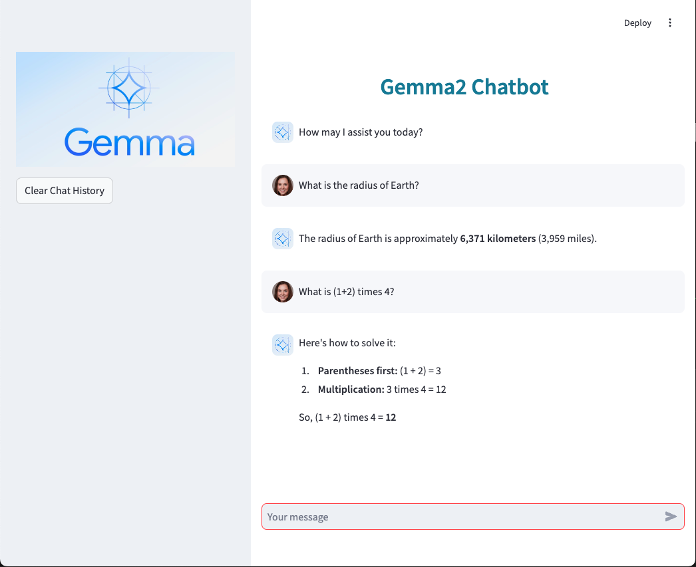

# Chatbot using a Kaggle Model

## Introduction

This small project demonstrates how to build a Chatbot using a Kaggle Models.
The model used in Gemma 2 (gemma-2-2b-it-v2).

## Backend

The backend uses a `ModelInterface` class and a `FastAPI` service.

The `ModelInterface` class initialize the model, loads the tokenizer and the model. 
It also implements a query function, `get_message_response`.

In the `FastAPI` application, the endpoint that receive requests from the frontend, upon user querying the chatbot, is `/chat_messages/` `[POST]`.

To start the backend, run:

`uvicorn main:app --reload`

## Frontend

The frontend is implemented using `streamlit`. When user enters a query, the endpoint from main app is accessed.

To start the frontend, run:

`streamlit run app.py`

See below an example of usage of the chatbot.

